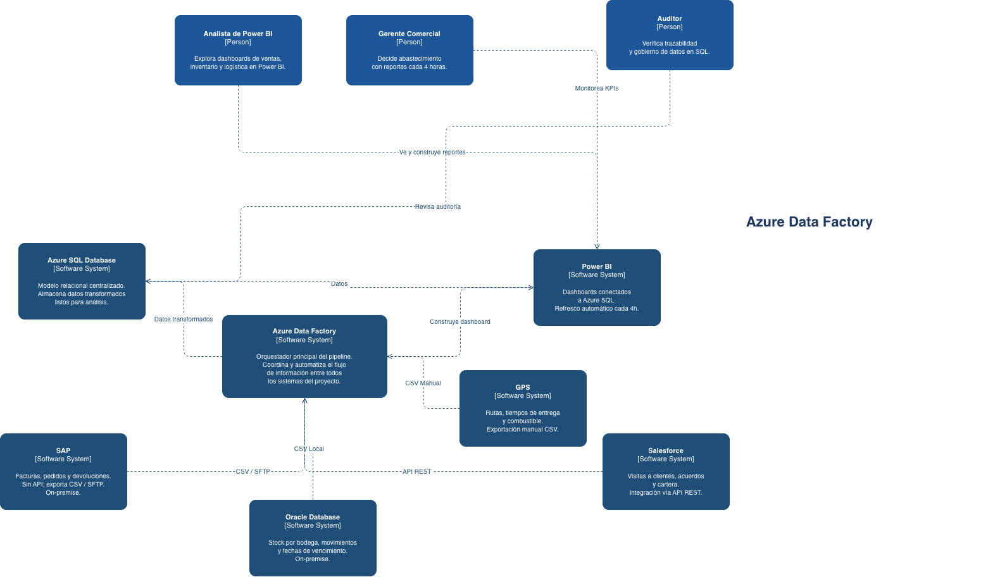
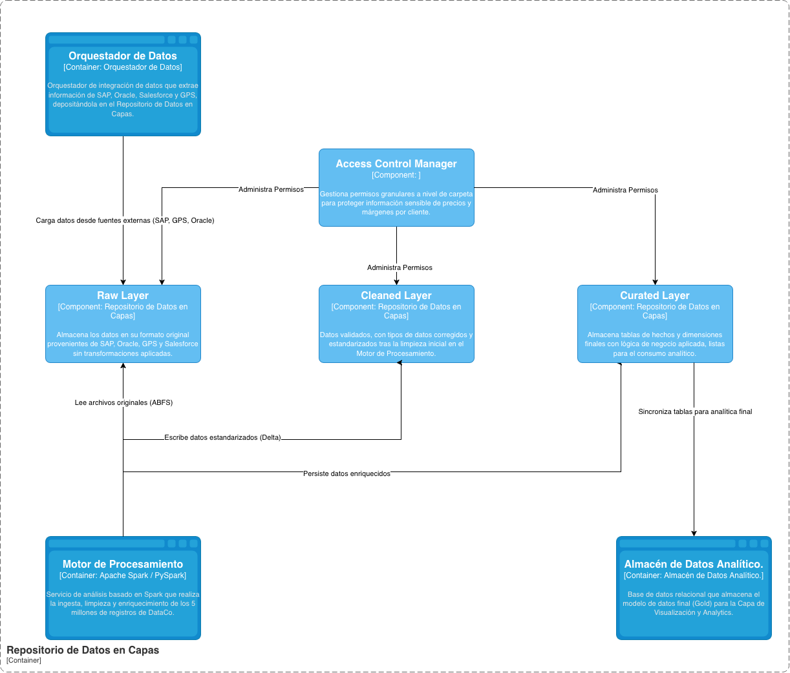
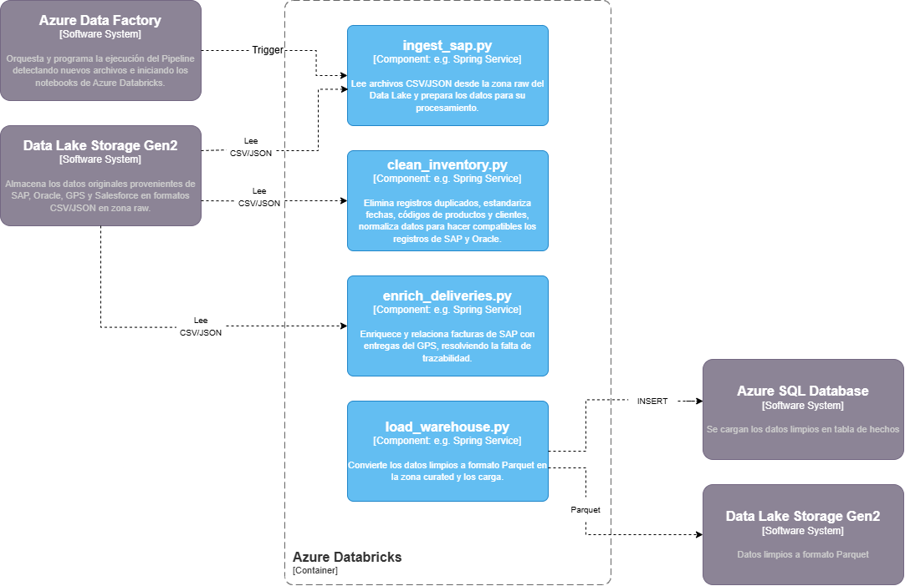
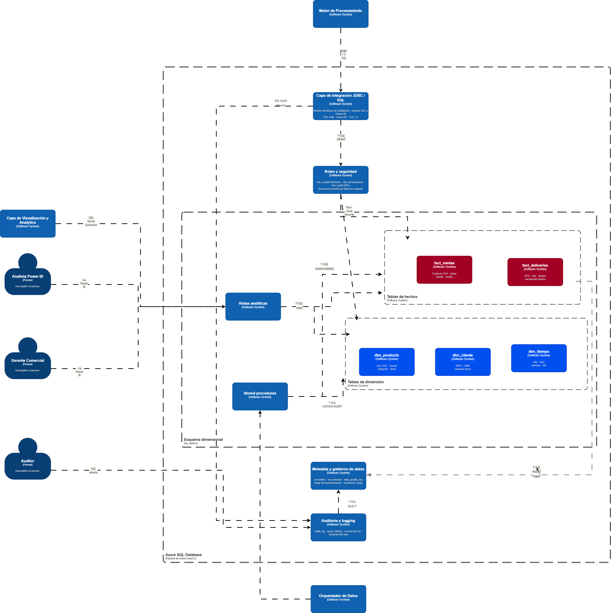
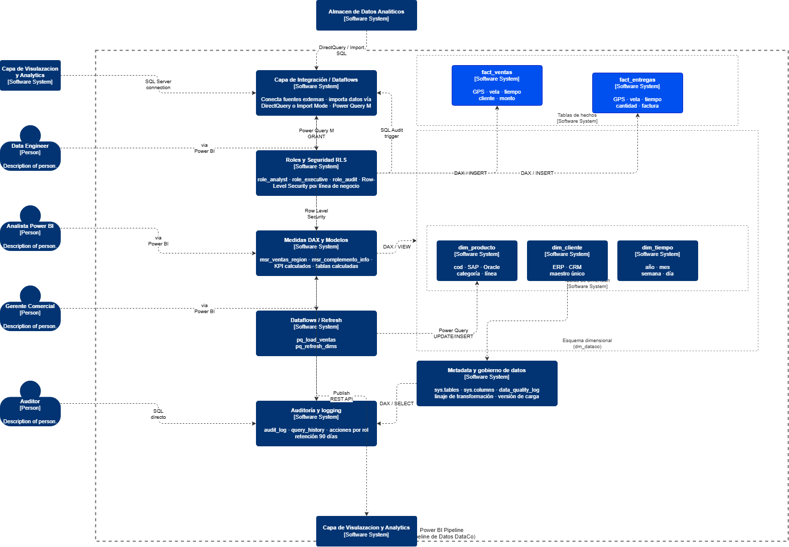
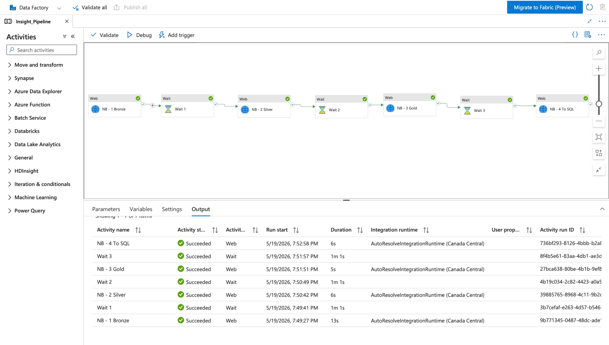
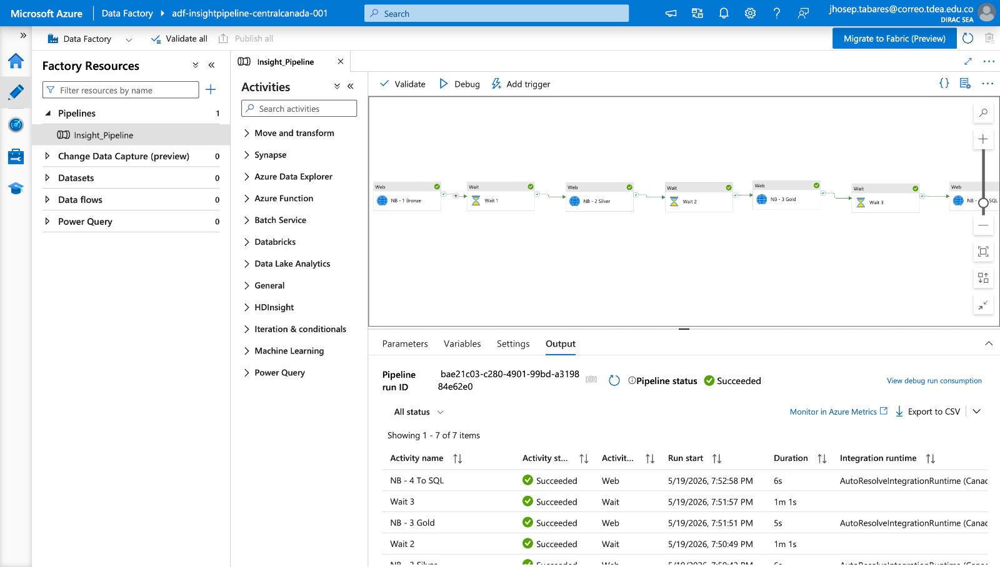
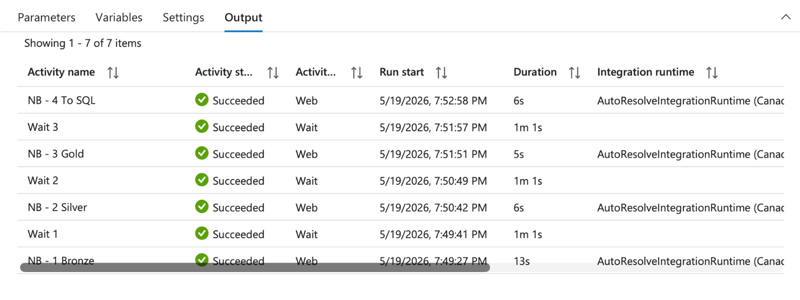

 # Nombre proyecto: InsightPipeline

 ## Tabla de control de cambios 
| ID  |  Autor        | Descripción del cambio           | Fecha      |
|:----| :--- |:---------------------------------|:-----------|
| 01  |Ana Sofia Puerta| Creación de documento            | 02-05-2026 |
| 02  | Ana Sofia Puerta, Ximena Gaibao, Jhosep Tabares, Yoseth lloreda, Oscar Uñates| Incorporación del diagrama de C1 | 05-05-2026 |
| 03 | Ana Sofia Puerta, Ximena Gaibao, Jhosep Tabares, Yoseth lloreda, Oscar Uñates| Incorporación de ADRs | 07-05-2026 |

---

## Contexto del caso

### Descripción de la empresa

DataCo es una empresa colombiana de distribución de productos de consumo masivo con operaciones en 12 departamentos del país. Fundada en 1998, cuenta con 1.800 empleados, una flota de 320 vehículos de reparto y más de 9.000 puntos de venta activos entre supermercados, tiendas de barrio y droguerías.

DataCo maneja tres líneas de negocio principales: distribución de alimentos perecederos (45% de ingresos), productos de aseo del hogar (32%) y cosméticos y cuidado personal (23%). Cada línea tiene su propio sistema de ventas, inventario y logística, lo que históricamente ha dificultado tener una visión unificada del negocio.

### Situación tecnológica actual y problemas identificados

Actualmente DataCo genera datos de negocio en cuatro sistemas distintos que operan de forma aislada, sin integración entre ellos:

| Sistema fuente | Tecnología | Datos que genera |
| :--- | :--- | :--- |
| **ERP de ventas** | **SAP On-premise** | Facturas, pedidos, devoluciones, precios por cliente. |
| **Sistema de inventario** | **Oracle Database local** | Stock por bodega, movimientos, fechas de vencimiento. |
| **GPS de flota** | **Archivos CSV exportados manualmente** | Rutas, tiempos de entrega consumo de combustible. |
| **CRM comercial** | **Salesforce Cloud** | Visitas a clientes, acuerdos comerciales y cartera. |

Esta fragmentación genera los siguientes problemas críticos que la gerencia ha escalado como prioridad estratégica para 2026:

* Reportes manuales y tardíos: el equipo de inteligencia de negocio tarda entre 3 y 5 días hábiles en consolidar información de los cuatro sistemas para generar un informe ejecutivo semanal. Este proceso implica exportar archivos Excel de cada sistema, limpiarlos manualmente y cruzarlos en hojas de cálculo.

* Decisiones desactualizadas: la gerencia comercial toma decisiones de abastecimiento con datos de inventario que tienen hasta 72 horas de rezago, lo que genera tanto quiebres de stock (pérdida de ventas) como sobrestock (costos de almacenamiento).

* Inconsistencia de datos: los mismos clientes están registrados con nombres distintos en el ERP y el CRM, y los productos tienen códigos diferentes en el sistema de inventario y en SAP, dificultando cualquier análisis cruzado.

* Sin trazabilidad de entregas: no existe forma de correlacionar automáticamente una factura de SAP con su entrega real registrada en el GPS, lo que impide medir el cumplimiento de promesas de entrega por ruta o vendedor.

* Escalabilidad nula: el servidor donde se hacen las consolidaciones manuales es un equipo de escritorio con Windows Server 2012. En los meses de cierre (diciembre y enero) el proceso de generación de reportes tarda hasta 8 horas continuas.

### Requerimientos para la nueva arquitectura
La gerencia de tecnología de DataCo ha definido los siguientes requerimientos que el pipeline de datos debe cumplir:

| Requerimiento | Métrica objetivo | Motivación |
| :--- | :--- | :--- |
| **Frecuencia de actualización** | Datos disponibles con máximo 4 horas de rezago | Reducir el ciclo de toma de decisiones de 3 días a horas |
| **Consolidación de fuentes** | Los 4 sistemas integrados en un único modelo de datos | Eliminar el proceso manual de cruce en Excel. |
| **Calidad de datos** | Tasa de registros limpios > 98% tras transformación | Garantizar confiabilidad en los reportes ejecutivos. |
| **Escalabilidad** | Procesar hasta 5 millones de registros por ejecución | Soportar cierres de mes y temporadas altas. |
| **Trazabilidad** | Auditoría completa de cada transformación aplicada | Cumplimiento de políticas internas de gobierno de datos. |
| **Disponibilidad de reportes** | Dashboard actualizado automáticamente sin intervención manual | Eliminar las 3-5 horas semanales del equipo de BI. |

### Restricciones del proyecto
* El equipo de datos de DataCo está compuesto por 2 analistas con conocimientos de SQL y Python básico, pero sin experiencia en Spark ni en administración de clusters de procesamiento distribuido.

* SAP On-premise no tiene API REST disponible. La integración debe hacerse mediante archivos exportados (CSV o JSON) depositados en una carpeta de red compartida o enviados por SFTP.

* El presupuesto mensual en Azure no debe superar los $80 USD durante la fase piloto. Databricks Premium puede usarse para el procesamiento monitoreando no pasarse de el presupuesto.

* Los datos de ventas contienen información sensible de precios y márgenes por cliente. El acceso al almacén de datos debe estar restringido por roles.

* Power BI ya está licenciado en la empresa (Power BI Desktop gratuito en los equipos de analistas). No se puede proponer una herramienta de visualización que implique costo adicional.

* El pipeline debe ser tolerante a fallos parciales: si uno de los cuatro sistemas fuente falla en un ciclo de ejecución, los datos de los demás sistemas deben procesarse igualmente.

---

## Arquitectura
### Diagrama de Contexto (C1)
El diagrama de contexto muestra una visión general del Pipeline de datos de DataCo como una caja negra, identificar sus roles principales y los sistemas externos con los que se relaciona (SAP, Oracle, GPS, Salesforce, Power BI).

  <figure>
    
    <figcaption>
       
      <i><b>Figure 1:</b> System Context Diagram.</i>
    </figcaption>
  </figure>

### Analista de Power BI
Este rol se encarga de analizar y visualizar los datos del negocio mediante dashboards e informes. Se conecta a Power BI, el cual obtiene la información desde el Pipeline de Datos DataCo, donde previamente se integran y transforman los datos provenientes de sistemas como SAP, Oracle, GPS y Salesforce. De esta manera, el analista no trabaja con datos crudos, sino con información ya limpia y estructurada.

Dentro del proyecto, su función está en la etapa final del flujo de datos, ya que convierte toda la información procesada en conocimiento útil para el negocio. Sus dashboards y reportes son utilizados por el Gerente Comercial para la toma de decisiones, por lo que actúa como un puente entre los datos técnicos y el uso estratégico de la información

### Gerente Comercial
El gerente comercial toma decisiones estratégicas basadas en información confiable y actualizada, accediendo a dashboards en Power BI donde visualiza indicadores clave del negocio como ventas e inventario.

Utiliza datos procesados por el Pipeline de Datos DataCo y almacenados en Azure SQL, los cuales provienen de sistemas como SAP ERP, Oracle Database y Salesforce CRM, para definir acciones comerciales y evaluar el desempeño.

### Auditor 
Este se encarga de garantizar que los datos de la empresa sean confiables y tengan trazabilidad. No consume dashboards de Power BI; su acceso es directo al sistema.

**Revisar auditoría** sobre el Pipeline de Datos DataCo, verificando que cada transformación aplicada sobre los datos quede registrada y sea trazable.
Esto incluye los logs de ejecución de Azure Data Factory y las tablas de auditoría en Azure SQL.
Este rol es importante para el cumplimiento de las políticas internas de datos de DataCo.

### Sistemas externos
Los sistemas externos son las fuentes de datos que alimentan el pipeline.
Todos envían la información hacia el sistema Pipeline.

**SAP** Es on-premise, sin API. Exporta ventas, pedidos y devoluciones en CSV vía SFTP de forma manual.

**Oracle** Es on-premise, sin API. Exporta stock, movimientos y fechas de vencimiento en archivos planos.

**GPS** No tiene integración automática. Un operador exporta manualmente CSV con rutas, tiempos de entrega, etc.

**Salesforce** Funciona con API REST. Es el único sistema con integración automática. Contiene información de visitas, acuerdos y cartera.

**Power BI** se conecta a Azure SQL y refresca automáticamente los datos cada 4 horas. Lo usa el Analista de BI para construir reportes y el Gerente Comercial para consultarlos.

### Diagrama de Contenedores (C2)
El diagrama de contenedores permite hacer un "zoom" dentro del límite del sistema InsightPipeline para desglosar la arquitectura de software en sus aplicaciones y almacenes de datos individuales. En esta vista se detallan las responsabilidades distribuidas, las elecciones tecnológicas clave y cómo estos componentes se comunican entre sí para cumplir con los requerimientos de procesamiento y latencia de DataCo.

  <figure>
    
    <figcaption>
       
      <i><b>Figure 2:</b> Containers Diagram.</i>
    </figcaption>
  </figure>

### Contenedor de Orquestación e Ingesta mediante Azure Data Factory
 Azure Data Factory cumple el papel de orquestador principal dentro del pipeline de datos de DataCo, ya que se encarga de coordinar y automatizar el flujo de información entre todos los sistemas del proyecto. Su función principal es conectar las diferentes fuentes de datos, controlar los procesos de carga y garantizar que la información llegue correctamente a cada etapa del sistema analítico.

Azure Data Factory se relaciona directamente con los sistemas fuente como SAP, Oracle Database, Salesforce y el sistema GPS, desde donde extrae datos en formatos CSV, JSON o mediante APIs REST. Esta integración permite centralizar información que originalmente se encuentra distribuida y aislada entre diferentes plataformas

### Contenedor de Almacenamiento Persistente en Azure Data Lake Storage Gen2
En el diagrama de contenedores se aprecia como Azure Data Lake Storage Gen2 actúa como el repositorio central y pilar de persistencia de los datos en InsightPipeline, permitiendo la transición de los datos desde un estado crudo hacia uno estructurado y optimizado. Su función principal es servir como zona de aterrizaje para la ingesta masiva de archivos CSV y JSON provenientes de fuentes heterogéneas como SAP, Oracle y GPS, los cuales son depositados allí bajo la orquestación de Azure Data Factory. Al implementar un espacio de nombres jerárquico, este componente facilita una organización eficiente que soporta el procesamiento de hasta 5 millones de registros, garantizando que la información esté disponible para las etapas posteriores de transformación dentro de los tiempos de rezago exigidos por el negocio.

La integración técnica de este almacenamiento permite un ciclo de procesamiento fundamental donde Azure Databricks extrae los archivos en bruto para ejecutar notebooks de limpieza y estandarización, devolviendo posteriormente la información enriquecida en formato Parquet a una zona refinada. Esta arquitectura de capas no solo optimiza el rendimiento de las consultas analíticas que alimentan a Azure SQL Database, sino que también garantiza al Auditor la trazabilidad necesaria para validar cada transformación según las políticas de gobierno de datos de DataCo. De este modo, el sistema asegura que los activos de información sean confiables, escalables y estén listos para la toma de decisiones estratégicas.

### Contenedor de Procesamiento y Transformación con Azure Databricks
Azure Databricks se encarga de la transformación del pipeline de DataCo. Se ejecuta y es activado por Azure Data Factory mediante un trigger que inicia la ejecución de los notebooks de limpieza, estandarización y enriquecimiento de datos en Apache Spark.

Se relaciona directamente con Data Lake Storage Gen2 en ambas direcciones: primero, desde la zona raw lee y sube los archivos CSV/JSON crudos y escribe los datos transformados en formato Parquet en la zona curated. Este formato mejora el rendimiento de las consultas siguientes. Luego de completar las transformaciones Databricks carga los datos procesados (tablas) directamente en Azure SQL Database, donde quedan disponibles para ser consultados por Power BI.

### Contenedor de Almacén Analítico en Azure SQL Database
es un servicio administrado de base de datos relacional en la nube de Microsoft basado en el motor de SQL Server. Proporciona alta disponibilidad, escalabilidad automática, seguridad avanzada y administración simplificada sin necesidad de gestionar infraestructura física. En el diagrama, Azure SQL Database actúa como el repositorio analítico central donde se almacena el modelo dimensional de datos, permitiendo consultas optimizadas para reporting, análisis comercial y auditoría. Además, implementa control de acceso por roles y sirve como fuente de datos para los dashboards de Power BI y las consultas SQL realizadas por usuarios de negocio y auditores.

Azure Databricks se conecta con Azure SQL Database para cargar los datos previamente transformados y enriquecidos durante los procesos ETL. Una vez almacenada la información en Azure SQL Database, Power BI se conecta directamente para consumir las tablas analíticas y actualizar automáticamente los dashboards cada 4 horas. De esta manera, Power BI permite que los usuarios visualicen indicadores de ventas, inventario, logística y auditoría en tiempo real, apoyando la toma de decisiones estratégicas y el análisis operativo del negocio.

### Contenedor de Visualización y Business Intelligence en Power BI
Power BI es la herramienta utilizada para visualizar y analizar toda la información procesada en el pipeline de datos. Se conecta directamente con Azure SQL Database para consultar los datos ya organizados y actualizados automáticamente cada 4 horas.

A través de dashboards interactivos, los analistas y gerentes pueden monitorear ventas, inventario, logística y abastecimiento en tiempo real. Además, Power BI permite crear reportes dinámicos, gráficos y métricas que facilitan la toma de decisiones comerciales.

También maneja seguridad mediante acceso por roles, asegurando que cada usuario vea únicamente la información correspondiente a su área. Finalmente, funciona como la capa visual del proyecto, transformando los datos técnicos del sistema en información clara, entendible y útil para el negocio.

### Diagrama de Componentes (C3)

### Componentes del Contenedor Azure Data Factory

  <figure>
    
    <figcaption>
       
      <i><b>Figure 3:</b> Azure Data Factory.</i>
    </figcaption>
  </figure>

El sistema integra cuatro fuentes principales: SAP (facturas y pedidos, exporta CSV/SFTP), Oracle Database (stock por bodega, on-premise), Salesforce (visitas y acuerdos comerciales, vía API REST) y GPS (rutas y tiempos de entrega, exportación manual CSV).
Azure Data Factory como orquestador central
ADF es el corazón del pipeline. Recibe datos de todas las fuentes mediante distintos mecanismos (CSV local, SFTP, API REST y carga manual) y coordina el flujo completo de información entre todos los sistemas.
Almacenamiento en Azure SQL Database
Una vez que ADF transforma los datos, los deposita en una base de datos SQL relacional centralizada, lista para análisis. Esta capa actúa como única fuente de verdad del modelo de datos.
Visualización en Power BI
Power BI se conecta directamente a Azure SQL y construye dashboards de ventas, inventario y logística con refresco automático cada 4 horas. El Gerente Comercial consume estos reportes para tomar decisiones de abastecimiento.
Usuarios y gobierno de datos
Tres perfiles interactúan con el sistema: el Analista de Power BI que construye los reportes, el Gerente Comercial que los consume para decidir, y el Auditor que verifica trazabilidad y gobierno de datos directamente sobre SQL, monitoreando KPIs de calidad

### Componentes del Contenedor Azure Data Lake Storage Gen2

  <figure>
    
    <figcaption>
       
      <i><b>Figure 4:</b> Azure Data Lake Gen2 Component Diagram.</i>
    </figcaption>
  </figure>

El diagrama representa la arquitectura interna del contenedor Azure Data Lake Storage Gen2, estructurado bajo el patrón de Arquitectura de Medallón para garantizar la integridad de los 5 millones de registros de DataCo. El flujo inicia con Azure Data Factory, que ingesta los datos crudos desde fuentes externas hacia la zona Bronze, mientras que el motor de Azure Databricks actúa como el núcleo de procesamiento al leer de dicha zona para limpiar, estandarizar y enriquecer la información progresivamente a través de las capas Silver y Gold. Este proceso culmina con la sincronización de las tablas refinadas hacia Azure SQL Database para el consumo analítico final.

La seguridad y el gobierno de los datos son gestionados de forma transversal por el componente Access Control Manager, el cual aplica políticas de permisos granulares (POSIX ACLs) sobre cada capa para proteger la información sensible de precios y márgenes. Simultáneamente, todas las operaciones de transformación realizadas por Databricks quedan registradas en el Audit & Telemetry Store mediante logs en formato JSON, permitiendo al Auditor verificar la trazabilidad completa del pipeline y asegurar el cumplimiento de los estándares de calidad exigidos por el negocio.

### Componentes del Contenedor Azure Databricks

  <figure>
    
    <figcaption>
       
      <i><b>Figure 5:</b> Azure Databricks Component Diagram.</i>
    </figcaption>
  </figure>

El diagrama C3 muestra los componentes internos de Azure Databricks Premium dentro de DataCo. Azure Data Factory inicia el proceso invocando los notebooks de forma modular, y `ingest_sap.py` sube y lee los archivos CSV/JSON al Storage Account del Data Lake en la zona raw/bronze. Luego `clean_inventory.py` limpia y estandariza los datos eliminando duplicados y normalizando fechas y códigos de producto entre SAP y Oracle, mientras que `enrich_deliveries.py` integra la información de ventas con los registros del GPS para resolver la falta de trazabilidad entre facturas y entregas reales.

Para finalizar el proceso, `load_warehouse.py` guarda los datos procesados en formato Parquet en la zona curated/gold del Data Lake y los carga en Azure SQL Database mediante autenticación IAM. Esta arquitectura modular automatiza la consolidación y transformación de la información, dejando los datos listos para análisis y visualización en Power BI Desktop.

---

### Componentes del Contenedor Azure SQL Datebase 

  <figure>
    
    <figcaption>
       
      <i><b>Figure 6:</b> System Component Diagram.</i>
    </figcaption>
  </figure>

**Capa de integración JDBC / SQL Audit.**  
Este componente actúa como interfaz de conexión segura entre los consumidores de datos (Power BI y herramientas externas) y Azure SQL. Utiliza JDBC, T-SQL, Azure AD y TLS 1.2. Recibe consultas vía JDBC/T‑SQL desde Power BI y otros clientes, se conecta al módulo de Roles y seguridad para validar permisos, y reenvía las consultas autorizadas al motor SQL subyacente. Intercambia consultas SQL, credenciales de usuario, metadatos de auditoría y conjuntos de resultados.

**Roles y seguridad.**  
Gestiona el control de acceso basado en roles (RBAC) y la seguridad a nivel de fila (RLS) mediante T‑SQL `GRANT` y vistas de seguridad integradas. Es validado por la Capa JDBC/SQL Audit antes de ejecutar cualquier consulta, y aplica políticas de lectura, escritura y DDL sobre las tablas `Fact_ventas`, `Fact_entregas`, `dim_producto` y las vistas analíticas. Intercambia roles de usuario, permisos sobre objetos y filtros de RLS por línea de negocio.

**Fact_ventas.**  
Tabla relacional en Azure SQL que almacena transacciones de facturación desde SAP. Su escritura es controlada por el rol `role_crl` (utilizado por Azure Data Factory o procesos ETL), mientras que la lectura se realiza mediante el rol `role_analyst` a través de vistas analíticas. Intercambia datos como facturas SAP, fecha, cliente y monto.

**Fact_entregas.**  
Tabla relacional en Azure SQL que registra eventos de GPS de rutas y tiempos de entrega. Se vincula lógicamente con `Fact_ventas` mediante correlación (por ejemplo, número de factura) y es consultada por las vistas analíticas para medir el cumplimiento de ruta. Intercambia información de GPS, ruta, tiempo y correlación con factura.

**dim_producto.**  
Tabla de dimensión en Azure SQL que provee datos maestros de producto, incluyendo códigos SAP, categoría y línea. Se relaciona con `Fact_ventas` mediante `cod_SAP` y sirve como fuente de datos para las vistas analíticas. Intercambia código SAP, categoría y línea de producto.

**Vistas analíticas.**  
Exponen métricas de negocio precalculadas, como ventas por región y cumplimiento de ruta, mediante vistas SQL materializadas o no materializadas. Son consumidas por Power BI a través de la Capa JDBC/SQL Audit y obtienen datos de `Fact_ventas`, `Fact_entregas` y `dim_producto`. Intercambian agregaciones de ventas e indicadores de logística.

**Stored procedures.**  
Ejecutan la lógica de carga (`usp_load_ventas`) y el control de calidad (`usp_rechaz_datos`) mediante procedimientos almacenados T‑SQL. Son invocados por Azure Data Factory durante los pipelines de ingestión y escriben en `Fact_ventas` y tablas de rechazos. Intercambian datos transformados, registros de error y conteos de filas cargadas.

**Auditoría y logging.**  
Registra todo acceso a datos y consultas por rol, con una retención de 90 días, utilizando tablas de auditoría como `audit_log_query_history` y posiblemente Azure SQL Auditing. Recibe eventos desde la Capa JDBC/SQL Audit y el motor SQL, y es consultable por el rol `role_audit`. Intercambia historial de consultas, usuario, timestamp y filas devueltas.

**Azure Data Factory (ADF).**  
Orquesta la ingesta y transformación de datos desde fuentes externas (SAP, GPS, Oracle) hacia Azure SQL. Utiliza pipelines, actividades Lookup y procedimientos almacenados. Ejecuta `usp_load_ventas` y `usp_rechaz_datos` en Azure SQL y se conecta a sistemas fuente. Intercambia datos crudos, comandos de ejecución de SPs y logs de actividad.

El **Gerente Comercial**, el **Analista Power BI**, el **Gerenciamiento de datos** y el **Auditor** son los principales actores externos. Los primeros tres se conectan a través de Power BI o clientes SQL para visualizar reportes y monitorear el sistema, mientras que el Auditor revisa los logs de auditoría y los permisos directamente.

#### Relaciones principales entre contenedores

La Capa JDBC se relaciona con Roles y seguridad asegurando que toda consulta pase por un punto único de autenticación y autorización. Roles y seguridad aplica permisos de lectura, escritura y RLS sobre las tablas de hechos y dimensiones según la línea de negocio. Azure Data Factory invoca los stored procedures, desacoplando así la orquestación de la lógica de negocio. Las vistas analíticas encapsulan la lógica de negocio y agregan datos desde las tablas de hechos para un consumo eficiente en Power BI. Finalmente, la auditoría registra cada acceso desde la Capa JDBC para garantizar la trazabilidad.

#### Flujo general de comunicación

El flujo comienza con la ingesta y transformación: Azure Data Factory extrae datos de SAP (facturas), GPS (entregas) y Oracle (productos), y ejecuta los stored procedures `usp_load_ventas` y `usp_rechaz_datos` para cargar las tablas `Fact_ventas`, `Fact_entregas` y `dim_producto`. Luego, en la preparación analítica, sobre estas tablas base se crean las vistas analíticas (`ww_ventas_region`, `ww_complimiento_ruta`), que aplican reglas de negocio y RLS. En el acceso a datos, un Analista Power BI conecta su dashboard mediante JDBC/T‑SQL hacia la Capa de integración; esta capa delega la autenticación en Azure AD y verifica los roles contra el componente Roles y seguridad. Si el usuario posee el rol `role_analyst`, se ejecuta la consulta sobre las vistas analíticas y el motor SQL aplica el filtrado por línea de negocio. Paralelamente, cada consulta (exitosa o fallida) se escribe en `audit_log_query_history` para auditoría, y un Auditor con `role_audit` puede consultar este historial directamente. Finalmente, en la visualización, el Gerente Comercial y el Gerenciamiento de datos ven reportes predefinidos en Power BI sin acceder directamente a las tablas base.

### Componentes del Contenedor Power BI

  <figure>
    
    <figcaption>
       
      <i><b>Figure 5:</b> System Component Diagram.</i>
    </figcaption>
  </figure>

Este diagrama muestra una arquitectura de datos y análisis en Power BI conectada con servicios de Azure SQL Database y Azure Databricks. Básicamente, explica cómo los datos se integran, transforman, almacenan y finalmente se visualizan en Power BI para apoyar la toma de decisiones.

En el flujo, Azure Databricks procesa los datos y los envía mediante una capa de integración JDBC/SQL hacia la base de datos en Azure. Luego se manejan aspectos de roles y seguridad, permitiendo controlar qué usuarios pueden acceder a determinada información mediante permisos y seguridad a nivel de filas.
Después aparecen las tablas de hechos como fact_ventas y fact_entregas, que almacenan información principal del negocio, y las tablas de dimensión como dim_producto, dim_cliente y dim_tiempo, que sirven para organizar y analizar los datos de manera más eficiente. Este modelo corresponde a un esquema dimensional utilizado en inteligencia de negocios.

También se incluyen vistas analíticas, stored procedures, auditoría y gobierno de datos, los cuales ayudan a automatizar procesos, mantener la calidad de la información y registrar accesos o cambios realizados en el sistema.

Finalmente, Power BI Desktop se conecta a esta estructura mediante SQL Server Connector para que analistas, gerentes y auditores puedan crear dashboards, reportes e indicadores visuales que faciliten el análisis empresarial y la toma de decisiones.

---
### Evidencias 

### Azure Data Factory

  <figure>
    
    <figcaption>
       
      <i><b>Figure 1:</b> Azure Data Factory conexion.</i>
    </figcaption>
  </figure>

En esta imagen ejecutamos un pipeline llamado Insight_Pipeline. Lo lancé en modo debug y el resultado fue exitoso que se puede ver el estado "Succeeded" y los primeros detalles de las actividades en el panel inferior

  <figure>
    
    <figcaption>
       
      <i><b>Figure 2:</b> Azure Data Factory conexion.</i>
    </figcaption>
  </figure>

Aquí ya tengo una vista más clara del flujo completo del pipeline. Vemos la cadena secuencial de 7 actividades:  donde arranco con NB-1 Bronze, espero con Wait 1, proceso NB-2 Silver, espero con Wait 2, proceso NB-3 Gold, espero con Wait 3, y finalizo con NB-4 To SQL. Todo corrió exitosamente

  <figure>
    
    <figcaption>
       
      <i><b>Figure 3:</b> Azure Data Factory conexion.</i>
    </figcaption>
  </figure>

Ya finalmente la tabla nos muestra los resultados de las 7 actividades que ejecuté en el pipeline, todas con estado exitoso. Las actividades Web corresponden a los notebooks de cada capa (Bronze, Silver, Gold y To SQL) y me tomaron entre 5 y 13 segundos cada una, mientras que las tres actividades Wait introdujeron pausas de 1 minuto entre notebook y notebook

---

### Architectural Decision Records (ADRs)

* [ADR-01: Azure Data Factory vs Azure Logic Apps para la orquestación del pipeline](assets/adrs/adr-01.md)
* [ADR-02: Azure Databricks vs Azure Synapse Analytics para la transformación de datos](assets/adrs/adr-02.md)
* [ADR-03: Data Lake Storage Gen2 vs Blob Storage estándar como almacenamiento raw](assets/adrs/adr-03.md)
* [ADR-04: Azure SQL Database vs Azure Cosmos DB para el almacén analítico final](assets/adrs/adr-04.md)
* [ADR-05: Power BI Desktop vs Azure Analysis Services para la capa de visualización](assets/adrs/adr-05.md)

  <figure>
    
    <figcaption>
       
      <i><b>Figure 1:</b> Power BI Desktop.</i>
    </figcaption>
  </figure>

En Power BI se realizó la conexión y carga de datos para crear un dashboard interactivo, donde se visualizaron métricas como el total de productos, cantidades por mes y análisis de datos mediante gráficos y filtros dinámicos. Además, se organizaron las tablas para facilitar el análisis de la información y mejorar la visualización de los datos.

div align="center">
  <figure>
    
    <figcaption>
       
      <i><b>Figure 2:</b> Power BI Informe.</i>
    </figcaption>
  </figure>

En el servicio de Power BI se realizó el montaje y publicación del modelo de datos, permitiendo visualizar las tablas cargadas dentro del área de trabajo. Esto facilitó la administración de la información y dejó listo el entorno para la creación y actualización de reportes interactivos.