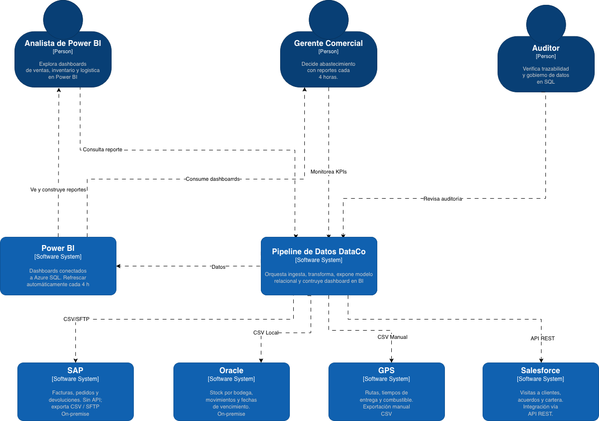

 # Nombre proyecto: InsightPipeline

 ## Tabla de control de cambios 
| ID  |  Autor        | Descripción del cambio           | Fecha      |
|:----| :--- |:---------------------------------|:-----------|
| 01  |Ana Sofia Puerta| Creación de documento            | 02-05-2026 |
| 02  | Ana Sofia Puerta, Ximena Gaibao, Jhosep Tabares, Yoseth lloreda, Oscar Uñates| Incorporación del diagrama de C1 | 05-05-2026 |
| 03 | Ana Sofia Puerta, Ximena Gaibao, Jhosep Tabares, Yoseth lloreda, Oscar Uñates| Incorporación de ADRs | 07-05-2026 |

---

## Arquitectura
### Diagrama de Contexto (C1)
El diagrama de contexto muestra una visión general del Pipeline de datos de DataCo como una caja negra, identificar sus roles principales y los sistemas externos con los que se relaciona (SAP, Oracle, GPS, Salesforce, Power BI).

  <figure>
    
    <figcaption>
       
      <i><b>Figure 1:</b> System Context Diagram.</i>
    </figcaption>
  </figure>

### Analista de Power BI
Este rol se encarga de analizar y visualizar los datos del negocio mediante dashboards e informes. Se conecta a Power BI, el cual obtiene la información desde el Pipeline de Datos DataCo, donde previamente se integran y transforman los datos provenientes de sistemas como SAP, Oracle, GPS y Salesforce. De esta manera, el analista no trabaja con datos crudos, sino con información ya limpia y estructurada.

Dentro del proyecto, su función está en la etapa final del flujo de datos, ya que convierte toda la información procesada en conocimiento útil para el negocio. Sus dashboards y reportes son utilizados por el Gerente Comercial para la toma de decisiones, por lo que actúa como un puente entre los datos técnicos y el uso estratégico de la información

### Gerente Comercial
El gerente comercial toma decisiones estratégicas basadas en información confiable y actualizada, accediendo a dashboards en Power BI donde visualiza indicadores clave del negocio como ventas e inventario.

Utiliza datos procesados por el Pipeline de Datos DataCo y almacenados en Azure SQL, los cuales provienen de sistemas como SAP ERP, Oracle Database y Salesforce CRM, para definir acciones comerciales y evaluar el desempeño.

### Auditor 
Este se encarga de garantizar que los datos de la empresa sean confiables y tengan trazabilidad. No consume dashboards de Power BI; su acceso es directo al sistema.

**Revisar auditoría** sobre el Pipeline de Datos DataCo, verificando que cada transformación aplicada sobre los datos quede registrada y sea trazable.
Esto incluye los logs de ejecución de Azure Data Factory y las tablas de auditoría en Azure SQL.
Este rol es importante para el cumplimiento de las políticas internas de datos de DataCo.

### Sistemas externos
Los sistemas externos son las fuentes de datos que alimentan el pipeline.
Todos envían la información hacia el sistema Pipeline.

**SAP** Es on-premise, sin API. Exporta ventas, pedidos y devoluciones en CSV vía SFTP de forma manual.

**Oracle** Es on-premise, sin API. Exporta stock, movimientos y fechas de vencimiento en archivos planos.

**GPS** No tiene integración automática. Un operador exporta manualmente CSV con rutas, tiempos de entrega, etc.

**Salesforce** Funciona con API REST. Es el único sistema con integración automática. Contiene información de visitas, acuerdos y cartera.

**Power BI** se conecta a Azure SQL y refresca automáticamente los datos cada 4 horas. Lo usa el Analista de BI para construir reportes y el Gerente Comercial para consultarlos.

### Diagrama de Container (C2)

---

### Architectural Decision Records (ADRs)

* [ADR-01: Azure Data Factory vs Azure Logic Apps para la orquestación del pipeline](assets/adrs/adr-01.md)
* [ADR-02: Azure Databricks vs Azure Synapse Analytics para la transformación de datos](assets/adrs/adr-02.md)
* [ADR-03: Data Lake Storage Gen2 vs Blob Storage estándar como almacenamiento raw](assets/adrs/adr-03.md)
* [ADR-04: Azure SQL Database vs Azure Cosmos DB para el almacén analítico final](assets/adrs/adr-04.md)
* [ADR-05: Power BI Desktop vs Azure Analysis Services para la capa de visualización](assets/adrs/adr-05.md)

---

## 5 ADRs

### Azure Data Factory
#### Título
Uso de Azure Data Factory como orquestador principal del pipeline de datos de DataCo

#### Contexto
DataCo enfrenta una fragmentación crítica de sus datos: cuatro sistemas fuente completamente aislados entre sí. El ERP de ventas corre sobre SAP On-premise sin API REST disponible, lo que obliga a trabajar con archivos CSV o JSON depositados por SFTP. El sistema de inventario opera sobre Oracle Database local, el GPS de flota genera archivos CSV exportados manualmente y el CRM comercial vive en Salesforce Cloud. Esta desintegración le cuesta a la empresa entre 3 y 5 días hábiles para consolidar un informe ejecutivo semanal, y el equipo de gerencia toma decisiones con hasta 72 horas de rezago en los datos de inventario.

Se necesita una herramienta que permita encadenar la ingesta desde esas cuatro fuentes hacia Azure Data Lake Storage Gen2, disparar los notebooks de transformación en Databricks y finalmente cargar los datos limpios en Azure SQL Database, todo dentro de un presupuesto mensual que no puede superar los $80 USD. El equipo de datos está formado por dos analistas con conocimientos de SQL y Python básico, sin experiencia en Spark ni administración de clusters, por lo que la operabilidad también fue un factor determinante en la evaluación.

Para tomar esta decisión se identificaron los drivers que condicionan directamente el comportamiento del orquestador: en el plano funcional, la herramienta debe ser capaz de mover datos diarios desde las cuatro fuentes heterogéneas (SAP por CSV/SFTP, Oracle por exportación JDBC, GPS por CSV manual y Salesforce por API REST), invocar notebooks de Databricks para la limpieza, estandarización de códigos de producto y cliente, eliminación de duplicados y enriquecimiento, y encadenar actividades con dependencias, condiciones de éxito o fallo y reintentos automáticos por cada fuente de forma independiente. Además, debe ejecutarse de forma programada cada 4 horas para cumplir el rezago máximo requerido, garantizar que si una de las cuatro fuentes falla en un ciclo las demás se procesen igualmente sin interrumpir el pipeline completo, ofrecer logs por actividad y visibilidad completa de cada ejecución para cumplir las políticas internas de gobierno de datos, e invocar notebooks de Azure Databricks y cargar resultados directamente en Azure SQL Database desde el mismo pipeline.

En el plano no funcional, los atributos que no pueden sacrificarse son: la escalabilidad para procesar hasta 5 millones de registros por ejecución y soportar cierres de mes y temporadas altas sin intervención manual; la seguridad mediante control de acceso por roles (RBAC) e integración con Key Vault para el manejo seguro de credenciales de las cuatro fuentes; el costo, con un presupuesto mensual máximo de $80 USD en fase piloto bajo un modelo pay-per-use sin costo en reposo; la mantenibilidad, para que los dos analistas SQL/Python puedan operar y mantener el pipeline sin necesidad de asistencia externa permanente; y la integración con el repositorio GitHub del proyecto para el versionamiento de pipelines y el despliegue controlado.

---

#### Alternativas evaluadas
##### Alternativa S1 — Azure Data Factory (ADF)

> **Ventajas:** Entre las ventajas de ADF se destacan que está diseñado para mover y transformar datos en batch a gran escala (TB/PB), que ofrece integración nativa con todo el stack —ADLS Gen2, Databricks y Azure SQL— sin necesidad de construir puentes adicionales, y que su tier gratuito de 5 actividades/mes es suficiente para la fase piloto sin comprometer el presupuesto de $80 USD. Además, su monitor de ejecución con logs por actividad garantiza la trazabilidad completa exigida por el gobierno de datos de DataCo, el aislamiento de fallos por rama asegura que si SAP falla los demás sistemas se procesen igualmente, y cuenta con CI/CD nativo con GitHub y Azure DevOps para el versionamiento de pipelines.

> **Desventajas:** En cuanto a las desventajas, ADF presenta un cold-start de 20 a 40 segundos que lo hace no apto para casos en tiempo real, una curva de aprendizaje moderada que obligará al equipo a formarse en ADF Studio y en el modelo de DIU, un precio por DIU que puede escalar de forma inesperada en Data Flows de alto volumen si no se monitorea, y la limitación de no ser apto para latencias sub-segundo, lo que implicaría complementarlo si DataCo requiere streaming en el futuro.

##### Alternativa S2 — Azure Logic Apps (ALA)

> **Ventajas:** Las ventajas de Logic Apps incluyen su diseñador visual intuitivo sin código, que es accesible para los dos analistas SQL/Python sin necesidad de formación en Spark; su latencia sub-segundo nativa, ideal para workflows event-driven y respuesta a eventos en tiempo real; su catálogo de más de 400 conectores para servicios empresariales, incluyendo el CRM Salesforce utilizado en DataCo; y la ausencia de gestión de clusters o infraestructura propia, lo que reduce la carga operativa del equipo.

> **Desventajas:** Como desventajas, Logic Apps no está diseñado para mover grandes volúmenes de datos en batch y trabaja únicamente con mensajes ligeros; carece de transformaciones complejas nativas como Spark o Data Flows para la limpieza avanzada de datos; tiene un modelo de precio por acción que resulta costoso a alto volumen y representa un riesgo real de superar los $80 USD mensuales; y no cuenta con actividad nativa para invocar notebooks de Databricks ni cargar datos directamente en Azure SQL.

### Azure SQL Database 
#### Título

Uso de Azure SQL Database sobre Azure Cosmos DB como almacén analítico
final del pipeline de datos de DataCo.

---

#### Contexto

DataCo requiere un almacén analítico final donde Azure Databricks deposite los datos transformados —tablas de hechos de ventas, inventario y logística, y dimensiones de clientes, productos y bodegas— para que Power BI Desktop genere dashboards ejecutivos actualizados automáticamente cada 4 horas.

Los ASR y drivers que determinan esta decisión son: la seguridad granular, dado que los datos de precios y márgenes por cliente exigen restricción de acceso por roles directamente en la base de datos, capacidad que solo Azure SQL ofrece de forma nativa con Dynamic Data Masking y Row-Level Security; la restricción presupuestal de 80 USD mensuales, que descarta Cosmos DB al tener un modelo de facturación por Request Units impredecible para cargas analíticas de agregación, mientras que Azure SQL Free Tier tiene costo cero durante el piloto; las habilidades del equipo, compuesto por 2 analistas con conocimientos de SQL y Python básico sin experiencia en el modelo de documentos ni en diseño de particionamiento de Cosmos DB; la compatibilidad nativa con Power BI Desktop gratuito, que incluye el conector SQL Server de forma predeterminada sin configuraciones adicionales; y la naturaleza relacional del modelo de datos, ya que el cruce de facturas SAP con registros GPS y la unificación de clientes entre SAP y Salesforce producen un esquema estrella, no documentos JSON anidados.

---

#### Alternativas evaluadas

##### Alternativa 1: Azure SQL Database

**Ventajas:**Incluye Free Tier (32 GB, 100.000 vCore-segundos/mes) sin costo durante el piloto, soporta Dynamic Data Masking y Row-Level Security de forma nativa, se integra con Databricks vía JDBC y con Power BI Desktop sin configuración adicional, y ofrece índices columnares para consultas
analíticas sobre millones de registros.

**Desventajas:**
Su escalabilidad es principalmente vertical, por lo que volúmenes mayores al piloto requerirían migrar a Azure Synapse Analytics, y su esquema fijo
implica que cualquier cambio estructural necesita migraciones controladas.

---

##### Alternativa 2: Azure Cosmos DB

**Ventajas:**
Ofrece esquema flexible para incorporar nuevas fuentes sin migraciones previas, escalabilidad horizontal automática para cargas de alta
concurrencia y un Free Tier permanente con 1.000 RU/s y 25 GB incluidos.

**Desventajas:**
Su facturación variable por RU/s es impredecible en consultas analíticas y puede superar los 80 USD del piloto, no ofrece Dynamic Data Masking ni
Row-Level Security de forma nativa, el conector para Power BI Desktop gratuito requiere configuración adicional no disponible en la versión
licenciada por DataCo, y el modelo de documentos y particionamiento representan una curva de aprendizaje alta para el equipo.

---

#### Decisión

<!-- DEJAR EN BLANCO -->

---

#### Consecuencias

<!-- DEJAR EN BLANCO -->
---

### Power BI Desktop
#### Título
Uso de Power BI Desktop como solución principal para la capa de visualización e inteligencia de negocio de DataCo

---

#### Contexto
DataCo requiere definir la herramienta principal para la capa de visualización e inteligencia de negocio del proyecto, considerando tanto los requerimientos funcionales como las restricciones técnicas y operativas existentes. Dentro de las necesidades identificadas se encuentra la conexión a múltiples fuentes de datos, la construcción de dashboards interactivos, la publicación y compartición de reportes, la actualización programada de información y el control de acceso por roles. Asimismo, se contemplan atributos no funcionales relacionados con rendimiento, escalabilidad, disponibilidad, seguridad, gobernanza, costos operativos y facilidad de mantenimiento.

Durante el análisis arquitectónico se evaluaron dos alternativas principales: Power BI Desktop junto con Power BI Service, y Azure Analysis Services como capa semántica centralizada consumida desde Power BI. La evaluación surgió debido a la necesidad de contar con una plataforma que permitiera autonomía a los analistas de negocio, integración con múltiples conectores de datos y facilidad para construir visualizaciones sin depender constantemente del equipo de ingeniería.

Dentro de los drivers arquitectónicos más relevantes se identificó la necesidad de minimizar costos operativos iniciales, reducir la complejidad de administración y facilitar la adopción tecnológica por parte del equipo actual. Adicionalmente, se consideró importante mantener una solución escalable que permitiera una futura evolución hacia modelos semánticos centralizados en caso de crecimiento del volumen de datos o mayores requerimientos de gobernanza.

El análisis evidenció que Power BI Desktop ofrece una interfaz intuitiva, integración nativa con diversas fuentes de información y una baja curva de aprendizaje, lo cual favorece la productividad del equipo y reduce tiempos de implementación. Sin embargo, presenta limitaciones relacionadas con la centralización del modelo de datos, el manejo de grandes volúmenes de información y la gobernanza distribuida entre múltiples archivos .pbix.

Por otro lado, Azure Analysis Services proporciona un modelo semántico centralizado, soporte para grandes datasets, integración nativa con Azure Active Directory y capacidades avanzadas de seguridad mediante RLS centralizado. No obstante, implica mayores costos operativos, necesidad de conocimientos especializados en modelado tabular y una complejidad de administración superior para el estado actual del proyecto.

#### Alternativas evaluadas
##### Alternativa 1: Power BI Desktop con Power BI Service

> **Ventajas:** Permite a los analistas de negocio crear y publicar reportes de manera autónoma sin dependencia constante del equipo técnico. Además, posee una interfaz intuitiva y una curva de aprendizaje baja, facilitando la adopción dentro del proyecto. Integra de forma nativa múltiples conectores de datos como Excel, SQL y APIs, y facilita la creación de dashboards interactivos y visuales. Su costo operativo es bajo para equipos pequeños y medianos, y permite la actualización programada de datos mediante Power BI Service y gateway.

> **Desventajas:** El modelo de datos se almacena localmente en archivos .pbix, generando silos de información. Presenta limitaciones para datasets superiores a 1 GB en licencias Pro. La gobernanza y centralización de métricas es limitada, mientras que el control de acceso y seguridad avanzada depende de configuraciones distribuidas. Además, la escalabilidad depende principalmente del dispositivo del usuario.

##### Alternativa 2: Azure Analysis Services

> **Ventajas:** Proporciona un modelo semántico único, centralizado y versionado para toda la organización. Además, soporta grandes volúmenes de datos sin limitaciones prácticas significativas y ofrece escalabilidad horizontal en la nube con alto rendimiento. Integra seguridad avanzada mediante Azure Active Directory y RLS centralizado, garantizando mayor disponibilidad y gobernanza de los datos. Asimismo, mantiene una latencia de consultas estable y consistente.

> **Desventajas:** Presenta un costo operativo elevado desde las configuraciones iniciales y requiere conocimientos avanzados en SSAS, DAX y administración de infraestructura Azure. También incrementa la complejidad de mantenimiento y configuración, reduce la autonomía de los analistas para construir soluciones de manera independiente y posee una curva de aprendizaje considerablemente más alta.

---

#### Decisión
<!-- DEJAR EN BLANCO -->

---

#### Consecuencias
<!-- DEJAR EN BLANCO -->

