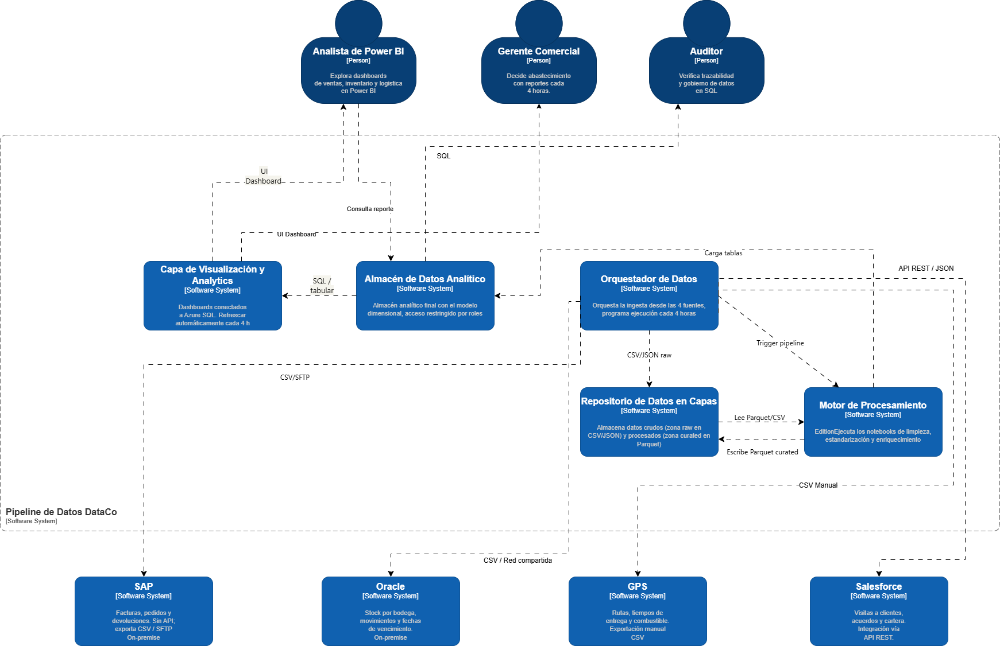

 # Nombre proyecto: InsightPipeline

 ## Tabla de control de cambios 
| ID  |  Autor        | Descripción del cambio           | Fecha      |
|:----| :--- |:---------------------------------|:-----------|
| 01  |Ana Sofia Puerta| Creación de documento            | 02-05-2026 |
| 02  | Ana Sofia Puerta, Ximena Gaibao, Jhosep Tabares, Yoseth lloreda, Oscar Uñates| Incorporación del diagrama de C1 | 05-05-2026 |
| 03 | Ana Sofia Puerta, Ximena Gaibao, Jhosep Tabares, Yoseth lloreda, Oscar Uñates| Incorporación de ADRs | 07-05-2026 |

---

## Contexto del caso

### Descripción de la empresa

DataCo es una empresa colombiana de distribución de productos de consumo masivo con operaciones en 12 departamentos del país. Fundada en 1998, cuenta con 1.800 empleados, una flota de 320 vehículos de reparto y más de 9.000 puntos de venta activos entre supermercados, tiendas de barrio y droguerías.

DataCo maneja tres líneas de negocio principales: distribución de alimentos perecederos (45% de ingresos), productos de aseo del hogar (32%) y cosméticos y cuidado personal (23%). Cada línea tiene su propio sistema de ventas, inventario y logística, lo que históricamente ha dificultado tener una visión unificada del negocio.

### Situación tecnológica actual y problemas identificados

Actualmente DataCo genera datos de negocio en cuatro sistemas distintos que operan de forma aislada, sin integración entre ellos:

| Sistema fuente | Tecnología | Datos que genera |
| :--- | :--- | :--- |
| **ERP de ventas** | **SAP On-premise** | Facturas, pedidos, devoluciones, precios por cliente. |
| **Sistema de inventario** | **Oracle Database local** | Stock por bodega, movimientos, fechas de vencimiento. |
| **GPS de flota** | **Archivos CSV exportados manualmente** | Rutas, tiempos de entrega consumo de combustible. |
| **CRM comercial** | **Salesforce Cloud** | Visitas a clientes, acuerdos comerciales y cartera. |

Esta fragmentación genera los siguientes problemas críticos que la gerencia ha escalado como prioridad estratégica para 2026:

* Reportes manuales y tardíos: el equipo de inteligencia de negocio tarda entre 3 y 5 días hábiles en consolidar información de los cuatro sistemas para generar un informe ejecutivo semanal. Este proceso implica exportar archivos Excel de cada sistema, limpiarlos manualmente y cruzarlos en hojas de cálculo.

* Decisiones desactualizadas: la gerencia comercial toma decisiones de abastecimiento con datos de inventario que tienen hasta 72 horas de rezago, lo que genera tanto quiebres de stock (pérdida de ventas) como sobrestock (costos de almacenamiento).

* Inconsistencia de datos: los mismos clientes están registrados con nombres distintos en el ERP y el CRM, y los productos tienen códigos diferentes en el sistema de inventario y en SAP, dificultando cualquier análisis cruzado.

* Sin trazabilidad de entregas: no existe forma de correlacionar automáticamente una factura de SAP con su entrega real registrada en el GPS, lo que impide medir el cumplimiento de promesas de entrega por ruta o vendedor.

* Escalabilidad nula: el servidor donde se hacen las consolidaciones manuales es un equipo de escritorio con Windows Server 2012. En los meses de cierre (diciembre y enero) el proceso de generación de reportes tarda hasta 8 horas continuas.

### Requerimientos para la nueva arquitectura
La gerencia de tecnología de DataCo ha definido los siguientes requerimientos que el pipeline de datos debe cumplir:

| Requerimiento | Métrica objetivo | Motivación |
| :--- | :--- | :--- |
| **Frecuencia de actualización** | Datos disponibles con máximo 4 horas de rezago | Reducir el ciclo de toma de decisiones de 3 días a horas |
| **Consolidación de fuentes** | Los 4 sistemas integrados en un único modelo de datos | Eliminar el proceso manual de cruce en Excel. |
| **Calidad de datos** | Tasa de registros limpios > 98% tras transformación | Garantizar confiabilidad en los reportes ejecutivos. |
| **Escalabilidad** | Procesar hasta 5 millones de registros por ejecución | Soportar cierres de mes y temporadas altas. |
| **Trazabilidad** | Auditoría completa de cada transformación aplicada | Cumplimiento de políticas internas de gobierno de datos. |
| **Disponibilidad de reportes** | Dashboard actualizado automáticamente sin intervención manual | Eliminar las 3-5 horas semanales del equipo de BI. |

### Restricciones del proyecto
* El equipo de datos de DataCo está compuesto por 2 analistas con conocimientos de SQL y Python básico, pero sin experiencia en Spark ni en administración de clusters de procesamiento distribuido.

* SAP On-premise no tiene API REST disponible. La integración debe hacerse mediante archivos exportados (CSV o JSON) depositados en una carpeta de red compartida o enviados por SFTP.

* El presupuesto mensual en Azure no debe superar los $80 USD durante la fase piloto. Databricks Community Edition puede usarse de forma gratuita para el procesamiento.

* Los datos de ventas contienen información sensible de precios y márgenes por cliente. El acceso al almacén de datos debe estar restringido por roles.

* Power BI ya está licenciado en la empresa (Power BI Desktop gratuito en los equipos de analistas). No se puede proponer una herramienta de visualización que implique costo adicional.

* El pipeline debe ser tolerante a fallos parciales: si uno de los cuatro sistemas fuente falla en un ciclo de ejecución, los datos de los demás sistemas deben procesarse igualmente.

---

## Arquitectura
### Diagrama de Contexto (C1)
El diagrama de contexto muestra una visión general del Pipeline de datos de DataCo como una caja negra, identificar sus roles principales y los sistemas externos con los que se relaciona (SAP, Oracle, GPS, Salesforce, Power BI).

  <figure>
    
    <figcaption>
       
      <i><b>Figure 1:</b> System Context Diagram.</i>
    </figcaption>
  </figure>

### Analista de Power BI
Este rol se encarga de analizar y visualizar los datos del negocio mediante dashboards e informes. Se conecta a Power BI, el cual obtiene la información desde el Pipeline de Datos DataCo, donde previamente se integran y transforman los datos provenientes de sistemas como SAP, Oracle, GPS y Salesforce. De esta manera, el analista no trabaja con datos crudos, sino con información ya limpia y estructurada.

Dentro del proyecto, su función está en la etapa final del flujo de datos, ya que convierte toda la información procesada en conocimiento útil para el negocio. Sus dashboards y reportes son utilizados por el Gerente Comercial para la toma de decisiones, por lo que actúa como un puente entre los datos técnicos y el uso estratégico de la información

### Gerente Comercial
El gerente comercial toma decisiones estratégicas basadas en información confiable y actualizada, accediendo a dashboards en Power BI donde visualiza indicadores clave del negocio como ventas e inventario.

Utiliza datos procesados por el Pipeline de Datos DataCo y almacenados en Azure SQL, los cuales provienen de sistemas como SAP ERP, Oracle Database y Salesforce CRM, para definir acciones comerciales y evaluar el desempeño.

### Auditor 
Este se encarga de garantizar que los datos de la empresa sean confiables y tengan trazabilidad. No consume dashboards de Power BI; su acceso es directo al sistema.

**Revisar auditoría** sobre el Pipeline de Datos DataCo, verificando que cada transformación aplicada sobre los datos quede registrada y sea trazable.
Esto incluye los logs de ejecución de Azure Data Factory y las tablas de auditoría en Azure SQL.
Este rol es importante para el cumplimiento de las políticas internas de datos de DataCo.

### Sistemas externos
Los sistemas externos son las fuentes de datos que alimentan el pipeline.
Todos envían la información hacia el sistema Pipeline.

**SAP** Es on-premise, sin API. Exporta ventas, pedidos y devoluciones en CSV vía SFTP de forma manual.

**Oracle** Es on-premise, sin API. Exporta stock, movimientos y fechas de vencimiento en archivos planos.

**GPS** No tiene integración automática. Un operador exporta manualmente CSV con rutas, tiempos de entrega, etc.

**Salesforce** Funciona con API REST. Es el único sistema con integración automática. Contiene información de visitas, acuerdos y cartera.

**Power BI** se conecta a Azure SQL y refresca automáticamente los datos cada 4 horas. Lo usa el Analista de BI para construir reportes y el Gerente Comercial para consultarlos.

### Diagrama de Contenedores (C2)
El diagrama de contenedores permite hacer un "zoom" dentro del límite del sistema InsightPipeline para desglosar la arquitectura de software en sus aplicaciones y almacenes de datos individuales. En esta vista se detallan las responsabilidades distribuidas, las elecciones tecnológicas clave y cómo estos componentes se comunican entre sí para cumplir con los requerimientos de procesamiento y latencia de DataCo.

  <figure>
    
    <figcaption>
       
      <i><b>Figure 2:</b> Containers Diagram.</i>
    </figcaption>
  </figure>

### Contenedor de Orquestación e Ingesta mediante Azure Data Factory
 Azure Data Factory cumple el papel de orquestador principal dentro del pipeline de datos de DataCo, ya que se encarga de coordinar y automatizar el flujo de información entre todos los sistemas del proyecto. Su función principal es conectar las diferentes fuentes de datos, controlar los procesos de carga y garantizar que la información llegue correctamente a cada etapa del sistema analítico.

Azure Data Factory se relaciona directamente con los sistemas fuente como SAP, Oracle Database, Salesforce y el sistema GPS, desde donde extrae datos en formatos CSV, JSON o mediante APIs REST. Esta integración permite centralizar información que originalmente se encuentra distribuida y aislada entre diferentes plataformas

### Contenedor de Almacenamiento Persistente en Azure Data Lake Storage Gen2
En el diagrama de contenedores se aprecia como Azure Data Lake Storage Gen2 actúa como el repositorio central y pilar de persistencia de los datos en InsightPipeline, permitiendo la transición de los datos desde un estado crudo hacia uno estructurado y optimizado. Su función principal es servir como zona de aterrizaje para la ingesta masiva de archivos CSV y JSON provenientes de fuentes heterogéneas como SAP, Oracle y GPS, los cuales son depositados allí bajo la orquestación de Azure Data Factory. Al implementar un espacio de nombres jerárquico, este componente facilita una organización eficiente que soporta el procesamiento de hasta 5 millones de registros, garantizando que la información esté disponible para las etapas posteriores de transformación dentro de los tiempos de rezago exigidos por el negocio.

La integración técnica de este almacenamiento permite un ciclo de procesamiento fundamental donde Azure Databricks extrae los archivos en bruto para ejecutar notebooks de limpieza y estandarización, devolviendo posteriormente la información enriquecida en formato Parquet a una zona refinada. Esta arquitectura de capas no solo optimiza el rendimiento de las consultas analíticas que alimentan a Azure SQL Database, sino que también garantiza al Auditor la trazabilidad necesaria para validar cada transformación según las políticas de gobierno de datos de DataCo. De este modo, el sistema asegura que los activos de información sean confiables, escalables y estén listos para la toma de decisiones estratégicas.

### Contenedor de Procesamiento y Transformación con Azure Databricks
Azure Databricks se encarga de la transformación del pipeline de DataCo. Se ejecuta en Community Edition y es activado por Azure Data Factory mediante un trigger que inicia la ejecución de los notebooks de limpieza, estandarización y enriquecimiento de datos en Apache Spark.

Se relaciona directamente con Data Lake Storage Gen2 en ambas direcciones: primero, desde la zona raw lee los archivos CSV/JSON crudos y escribe los datos transformados en formato Parquet en la zona curated. Este formato mejora el rendimiento de las consultas siguientes. Luego de completar las transformaciones Databricks carga los datos procesados (tablas) directamente en Azure SQL Database, donde quedan disponibles para ser consultados por Power BI.

### Contenedor de Almacén Analítico en Azure SQL Database

### Contenedor de Visualización y Business Intelligence en Power BI

---

### Architectural Decision Records (ADRs)

* [ADR-01: Azure Data Factory vs Azure Logic Apps para la orquestación del pipeline](assets/adrs/adr-01.md)
* [ADR-02: Azure Databricks vs Azure Synapse Analytics para la transformación de datos](assets/adrs/adr-02.md)
* [ADR-03: Data Lake Storage Gen2 vs Blob Storage estándar como almacenamiento raw](assets/adrs/adr-03.md)
* [ADR-04: Azure SQL Database vs Azure Cosmos DB para el almacén analítico final](assets/adrs/adr-04.md)
* [ADR-05: Power BI Desktop vs Azure Analysis Services para la capa de visualización](assets/adrs/adr-05.md)

